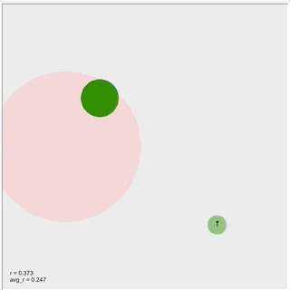

# PuckWorld game agent with deep q-learing



<!-- This is a python reproduce of [this](https://cs.stanford.edu/people/karpathy/reinforcejs/puckworld.html) js implement of PuckWorld game Agent.-->

python3 and pytorch are required.

## UI Implement

I draw the UI and animation using turtle library of python.

## Run parameters

Modify the variabls in the end of `DNQ.py`.

default configuration

```
load_model = True     # True if load the trained model
Train = False         # True if you want to train the model
Player_mode = False   # True if you want to play by keyboard(press WASD)
alpha = 0.01          # learning rate
initial_epsilon = 0.2 # initial epsilon for epsilon greedy(decrese with time)
gamma = 0.9           # disconut rate in q-learing
```

If you want to train the model from the begining, set

`Train = Ture`, `load_model = False`, and `Player_mode = False`.

## Model and output

` trained_network.pth` is the trained network with good performace.

In train mode, for every 5000 rounds, the program will output the current trained model named `'network'+str(round)+'.pth'`.

For every 32 rounds, the program will write the current average reward(from the begining) to `reward.log`.

